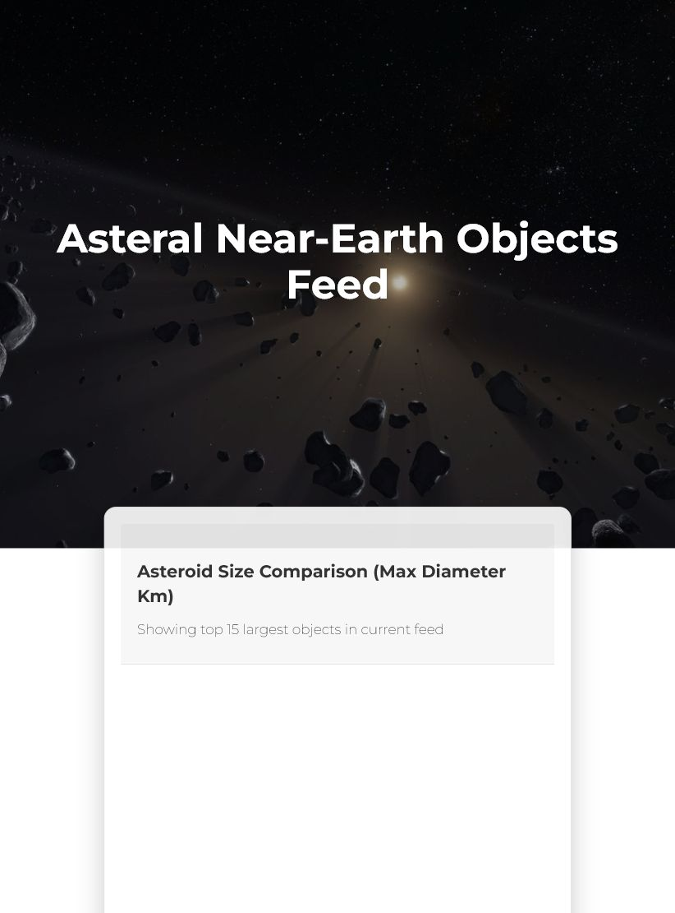
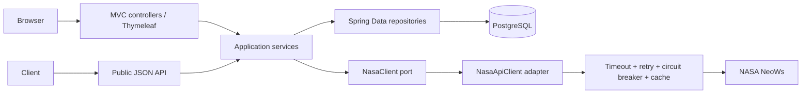

# Asteral: NASA Near-Earth Object Explorer

Asteral is a Java 21 and Spring Boot web application for exploring NASA NeoWs
asteroid data and keeping private per-user favorites. The repository is a
portfolio case study in secure configuration, deterministic third-party API
testing, resilience, observability, and container delivery.

This is a demonstration project, not a production service.



## Verified capabilities

- Spring Security form login, BCrypt password hashing, authorization tests, and
  CSRF-protected favorite mutations
- PostgreSQL persistence with Flyway migrations and per-user favorite isolation
- Typed and validated NASA API configuration
- Explicit connect/read timeouts, retry, circuit breaker, cache, and defined
  fallback behavior
- WireMock tests for success, timeout, rate limit, malformed response, retry,
  circuit breaker, and fallback without a real NASA key
- Testcontainers PostgreSQL tests in environments with Docker
- Correlation IDs, structured JSON API errors, Actuator probes, and Prometheus
  metrics
- Non-root multi-stage container and a complete Docker Compose demo
- CI jobs for tests/coverage, dependency review, CodeQL, Gitleaks, Trivy, and a
  Docker smoke test

## Architecture



The NASA cache contains only shared upstream data. User-specific favorite flags
are applied to a defensive copy after the cache boundary.

See [architecture.md](docs/architecture.md) and [ADRs](docs/adr/README.md).

## One-command demo

Requirements: Docker Desktop or another running Docker engine.

PowerShell:

```powershell
./scripts/start-demo.ps1
```

macOS/Linux:

```bash
./scripts/start-demo.sh
```

The script creates an ignored `.env` with a random local database password,
builds the image, starts PostgreSQL and the app, and waits for readiness.
Open <http://localhost:8080>. Register a user in the UI; no demo credentials are
seeded. NASA's rate-limited public `DEMO_KEY` is used unless `NASA_API_KEY` is
set.

Stop and remove demo data:

```bash
docker compose down -v
```

## Verification

```bash
./mvnw clean verify
./mvnw -Pintegration clean verify
DB_PASSWORD=verification-only docker compose config --quiet
kubectl kustomize k8s
./mvnw -Pperformance -Dtest=CachePerformanceEvidenceTest test
```

`clean verify` runs unit, MVC security, WireMock, and coverage checks without
requiring Docker. `-Pintegration clean verify` additionally requires and runs
the PostgreSQL Testcontainers suite; it fails rather than silently skipping
when Docker is unavailable. CI uses this integration profile. JaCoCo enforces a
70% instruction-coverage gate. The latest verified full run completed 38
standard tests and 2 PostgreSQL tests with no skips; the standard suite measured
72.04% instruction coverage.

## Resilience behavior

| Scenario | Verified behavior |
| --- | --- |
| NASA success | Response is parsed and cached by date range or asteroid ID |
| HTTP 429 / transient HTTP error | Up to 3 attempts with a bounded wait |
| Read timeout | Retry policy runs, then feed returns an empty fallback |
| Malformed payload | Retry policy runs, then feed returns an empty fallback |
| Repeated failures | Circuit opens and short-circuits further calls |
| Detail lookup failure | Structured `503` JSON for API clients; error page for UI |

The exact scenarios are reproducible in
[`NasaApiClientIntegrationTest`](src/test/java/com/nasa/asteral/integration/nasa/NasaApiClientIntegrationTest.java).

## Measured results

The cache benchmark uses a local WireMock server with a fixed 75 ms upstream
delay. It measures application/cache overhead, not NASA or internet performance.
Results from the latest verified run are recorded in
[performance-results.md](docs/performance-results.md).

No production throughput, availability, or security certification is claimed.

## Security model

- No API keys, database passwords, or seeded credentials belong in Git.
- Default/demo mode may use NASA's public `DEMO_KEY`.
- `prod` profile startup requires `NASA_API_KEY`, `DB_USERNAME`, and
  `DB_PASSWORD`.
- Database passwords are generated for the local Compose demo.
- Kubernetes manifests reference a separately created secret.

**Owner action required:** a NASA key was previously committed. Removing it from
the current tree does not revoke it or erase Git history. Revoke it and follow
the coordinated cleanup instructions in [SECURITY.md](SECURITY.md).

## Limitations

- Compose is a local demo, not a production topology.
- Kubernetes manifests deploy only the app; database, TLS, ingress, backup, and
  secret-manager integration are intentionally out of scope.
- Feed fallback is empty rather than stale-cache serving.
- NASA `DEMO_KEY` is rate limited.
- Testcontainers and Docker smoke tests require a running Docker engine.

## Roadmap

- Add stale-while-revalidate caching with explicit freshness metadata
- Add password reset/email verification and account lifecycle controls
- Add browser-level accessibility and visual regression tests
- Publish a versioned image and deployment environment

## Project evidence

- [Technical case study](docs/case-study.md)
- [Architecture](docs/architecture.md)
- [Security policy](SECURITY.md)
- [Contributing guide](CONTRIBUTING.md)

Recommended repository description:

> Java 21/Spring Boot NASA asteroid explorer demonstrating secure configuration,
> resilience, deterministic integration tests, observability, and container CI.

Recommended GitHub topics: `java`, `spring-boot`, `postgresql`, `flyway`,
`resilience4j`, `wiremock`, `testcontainers`, `docker`, `github-actions`,
`nasa-api`.

## License

[MIT](LICENSE)
